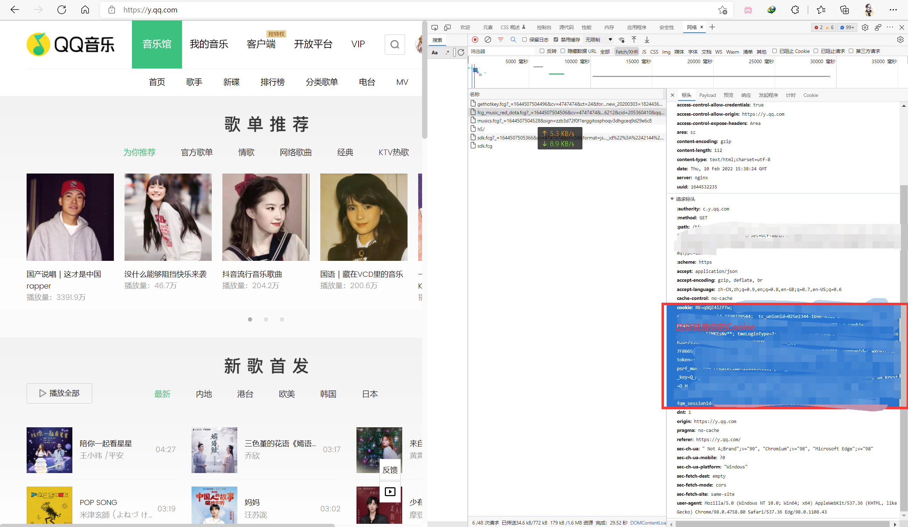
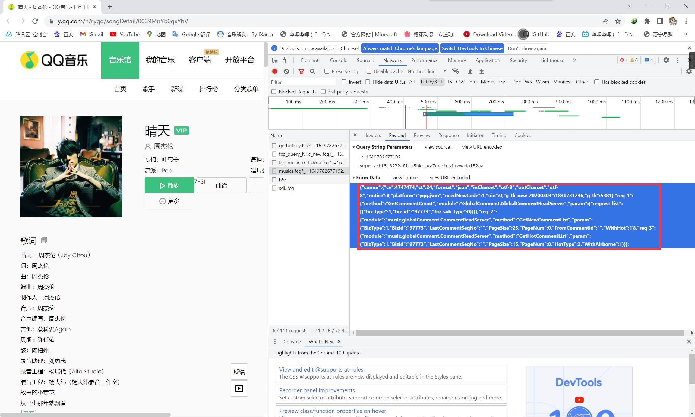

# QQ音乐解析

## CodeBy MCQTSS

### 支持功能:

#### 解析音乐下载地址

#### 解析MV下载地址

#### 获取音乐信息

#### 获取MV信息(和解析MV下载地址一个函数)

#### 获取专辑信息

#### 搜索音乐

#### 获取歌单信息(可以获取完全部的)

#### 获取QQ音乐推荐歌单

#### 获取音乐歌词信息

#### 获取个性电台信息

#### 流行指数榜单获取

### 写的其他解析:[酷狗音乐解析](https://github.com/MCQTSS/KuGouMusic)

### 这个的B站专栏:[点我打开](https://www.bilibili.com/read/cv15833876)

### 闲的没事更新了下,加了点功能

# 包含文件&使用的第三方库&Python版本

| 文件名             | 作用                      |
|:----------------|:------------------------|
| Readme.MD       | 说明                      |
| Main.py         | 主程序                     |
| demo.py         | 使用方法-搜索,获取音乐下载地址,获取专辑信息 |
| demo_1.py       | 使用方法-解析全部歌单(随便写的)       |
| demo_toplist.py | 使用方法-流行指数榜单获取           |
| demo_mv.py      | 使用方法-获取MV下载地址以及信息       |

| 名称       | 版本     |
|:---------|:-------|
| Python   | 3.9    |
| requests | 2.27.1 |

# 函数&类作用

| 类名       | 作用     |
|:---------|:-------|
| QQ_Music | 存放主要函数 |

| QQ_Music中的函数名            | 作用                                    | 需要提交参数                                                                            |
|:-------------------------|:--------------------------------------|-----------------------------------------------------------------------------------|
| set_cookie               | 设置Cookie(吧Cookie转换为Python字典格式)        | Cookie:获取方式请参考[如何获取Cookie](#如何获取Cookie)                                           |
| get_music_url            | 通过音乐MID解析音乐播放URL                      | music_mid:音乐的MID,https://y.qq.com/n/ryqq/songDetail/xxx (xxx就是这首歌的MID)或搜索返回结果时会返回 |
| get_song_info            | 通过搜索返回的音乐ID来获取当前音乐信息(MID,曲名,专辑名)      | music_id:音乐ID,搜索返回的结果有                                                            |
| get_album_info           | 通过专辑MID获取专辑信息,MID在搜索,获取音乐信息时返回        | album_mid:专辑MID                                                                   |
| search_music             | 搜索音乐                                  | name:要搜索的音乐名 limit:返回的音乐数量                                                        |
| get_playlist_info        | 获取歌单信息(只能返回10个)                       | playlist_id:歌单ID                                                                  |
| get_playlist_info_num    | 可以返回更多歌单,不过需要15个15个挨个获取(更多没试),写法看demo | playlist_id:歌单ID song_num:获取的数量,是上一次获取的+15                                        |
| get_recommended_playlist | 获取QQ音乐推荐歌单,获取内容应该和Cookie有关            | 无,设置好Cookie就行                                                                     |
| get_lyrics               | 通过歌曲Mid获取                             | mid:歌曲Mid,可在搜索,获取音乐信息中获取                                                          |
| get_radio_info           | 获取个性电台信息,获取内容应该和Cookie有关              | 无,设置好Cookie就行                                                                     |
| get_toplist_music        | 获取QQ流行歌曲榜单信息                          | 无,目前cookie也不需要提交所有人都一样                                                            |
| get_mv_url               | 获取MV下载地址,信息                           | vid:MV的VID,搜索时获取(demo.py已更新写法)                                                    |

# 如何获取Cookie

#### 1.打开 [QQ音乐官网](https://y.qq.com/) 后登录QQ音乐

#### 2.按下F12或右键检测打开开发者工具并选择网络选项(部分浏览器叫Network)

#### 3.按Ctrl+R刷新网页后在Fetch/XHR中随便找一个让后打开他的标头(Headers)

#### 4.在请求标头(RequestHeaders)中找到Cookie并右键复制即可

#### Tips:Cookie有过期时间,只有绿钻的Cookie才能解析绿钻歌曲

 

# 解析或部分操作data的获取方法

#### 下图中画红框的地方就是data的数据,格式json

#### 复制进去后稍微改点东西就行,比如音乐mid之类的

#### 获取完成data数据后直接使用万能提交接口提交即可

### https://u.y.qq.com/cgi-bin/musicu.fcg?data=抓到的data数据

 

#### 至于剩下的基本都是直接获取他的html然后正则匹配网页中的json了

# 机器人(号没了,暂时别用了)

### 机器人QQ:2910945342

### 拉群后发送/help获取使用方法,目前支持:

#### 搜索音乐

#### 获取歌词

#### 获取MV

#### 查原神,(使用了[YuanShen_User_Info](https://github.com/Womsxd/YuanShen_User_Info))

# 赞助

### [爱发电](https://afdian.net/@mcqtss)

### 支付宝

### 微信

